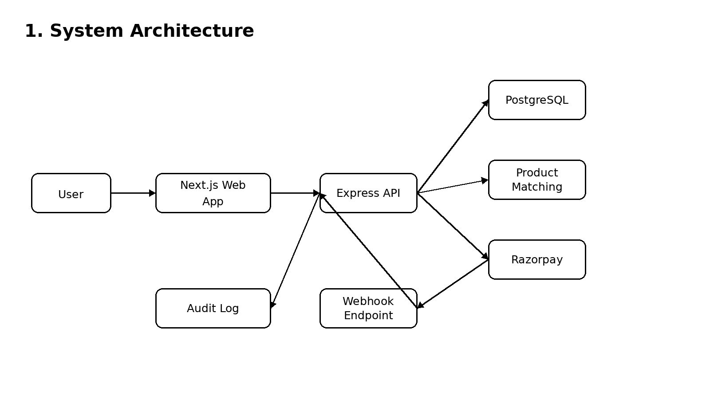
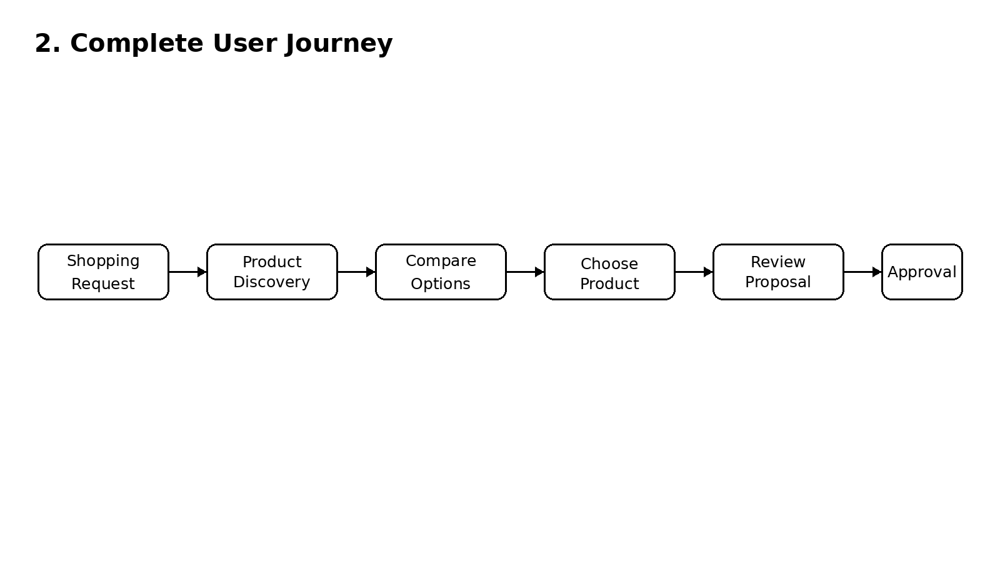
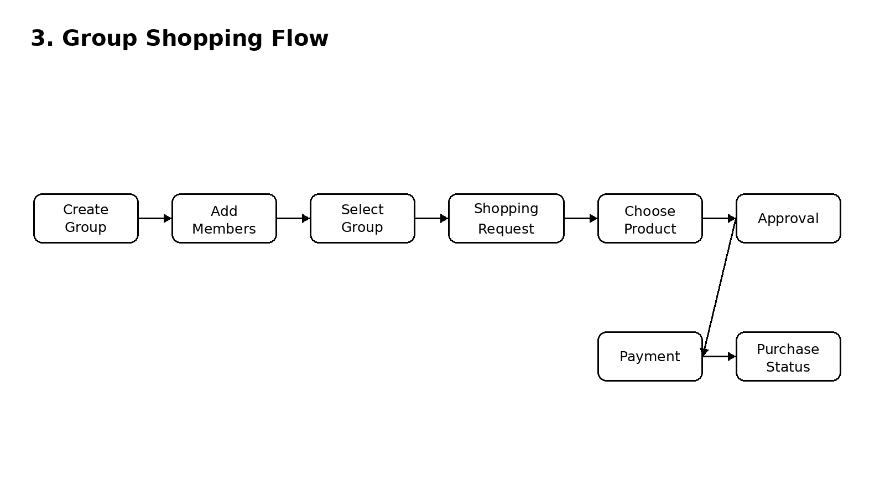
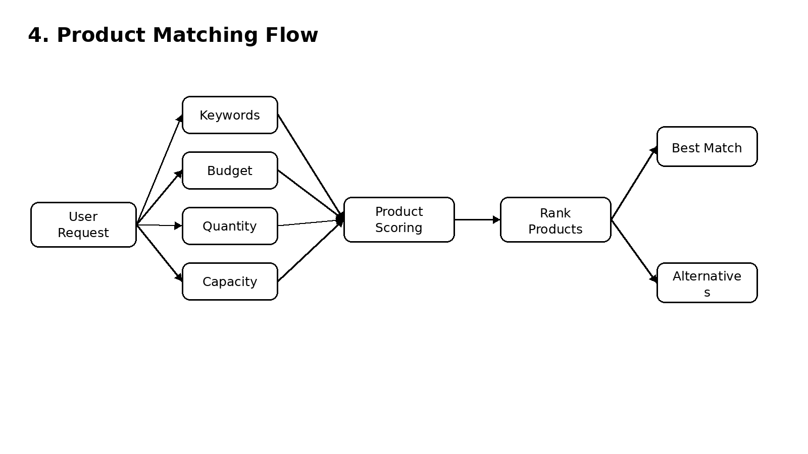
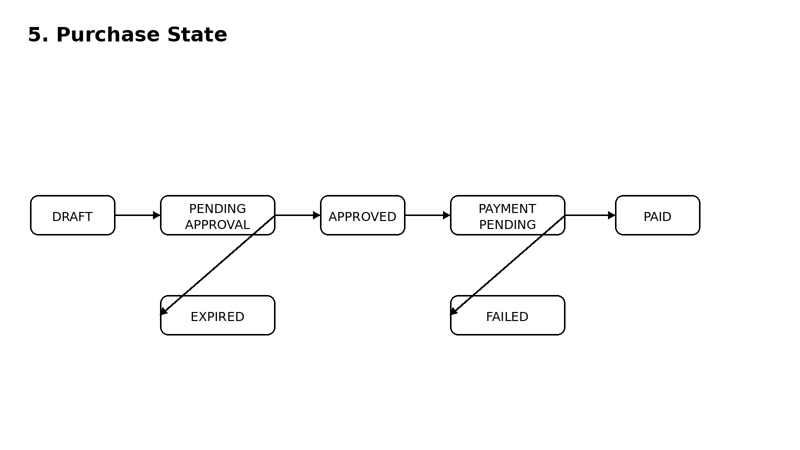
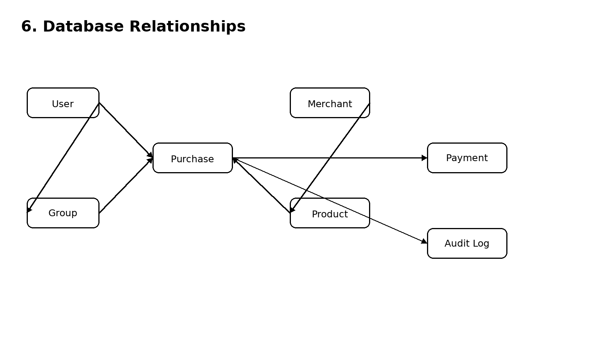
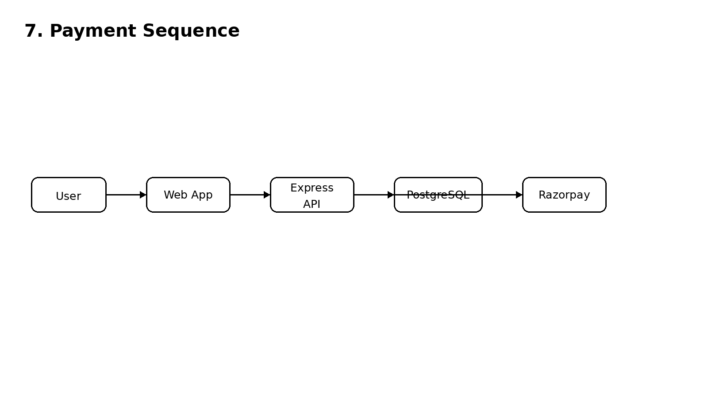
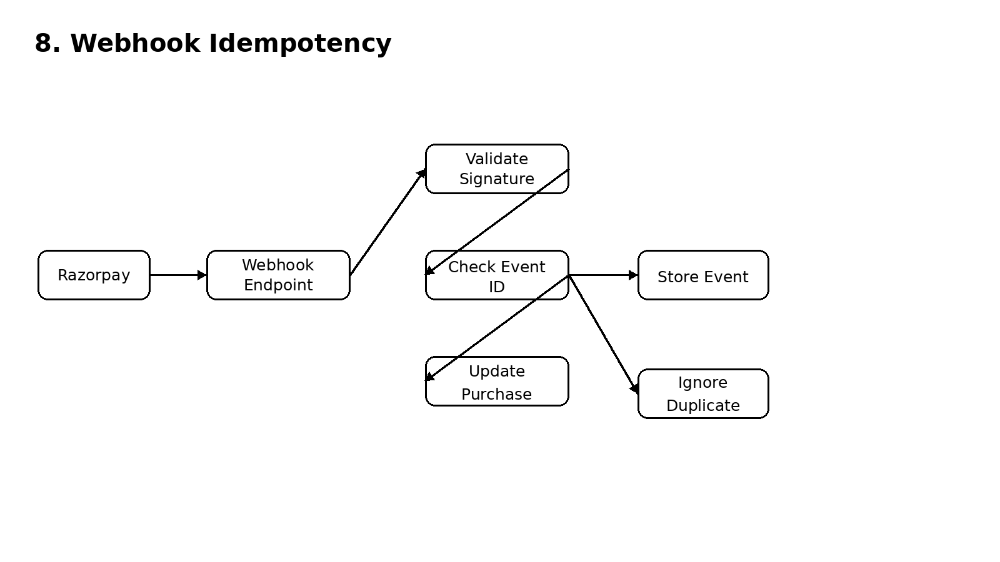
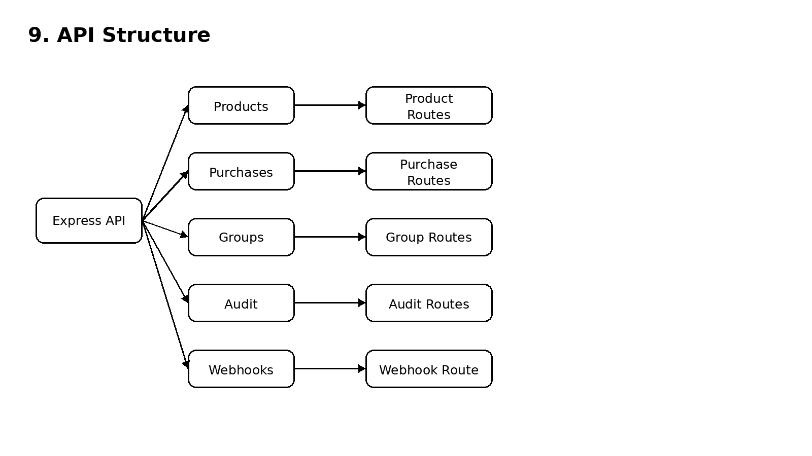
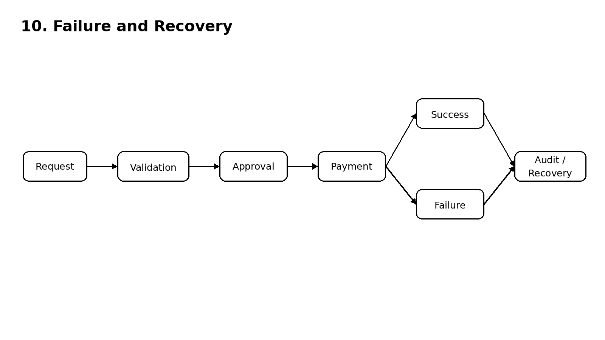

# TOGETHER Architecture

These diagrams and specifications document the application structure, state models, functional requirements, security boundaries, and payment reconciliation flows for **TOGETHER**.

---

## Diagrams

### 1. System Architecture


### 2. Complete User Journey


### 3. Group Shopping Flow


### 4. Product Matching Flow


### 5. Purchase State


### 6. Database Relationships


### 7. Payment Sequence


### 8. Webhook and Idempotency


### 9. API Structure


### 10. Failure and Recovery


---

## Functional Requirements

- **Enter a shopping request**: Users state shopping intent via prompt input text or hands-free voice interactions.
- **Discover and compare products**: Search and filter catalog items across price bounds, specs, and features.
- **Select a product and review a purchase proposal**: Create a purchase proposal in `DRAFT` state with selected item breakdown.
- **Create groups and manage members**: Organize shopping groups with defined owners, member lists, and role permissions.
- **Link a group purchase to a selected group**: Associate a purchase proposal with a specific shopping group circle.
- **Require approval before payment**: Enforce explicit group/owner approval (`PENDING_PAYMENT`) prior to order generation.
- **Create payment orders through the server**: Generate Razorpay payment orders strictly via backend API calls (`POST /api/purchases/:id/payment-order`).
- **Use Razorpay Test Mode for checkout**: Complete transactions using Razorpay Test Mode checkout modals.
- **Verify payment status through the server**: Securely verify client checkout signatures (`POST /api/purchases/:id/verify-payment`) with fallback server-to-server Razorpay API checks.
- **Process Razorpay webhook events**: Handle async `payment.captured` and `payment.failed` notifications via `POST /api/webhooks/razorpay`.
- **Handle duplicate webhook delivery safely**: Deduplicate incoming webhooks by `x-razorpay-event-id` using unique database constraints.
- **Record purchase activity in the audit log**: Write immutable event logs for every status transition and webhook reconciliation.
- **Display purchase status**: Present real-time state feedback (`PENDING`, `PAID`, `FAILED`) to buyers and group participants.

---

## Reliability and Security Requirements

- **Validate request data on the server**: Enforce structural and semantic payload validation across all API routes.
- **Validate purchase data before payment**: Verify item existence, pricing integrity, and order linkage prior to order creation.
- **Check group membership for group purchases**: Restrict group purchase submission and approval strictly to active group members.
- **Use stored purchase data for payment amounts**: Compute Razorpay order amounts from backend database items rather than client inputs.
- **Validate webhook signatures**: Authenticate incoming webhook payloads using timing-safe HMAC SHA256 signature comparison.
- **Track webhook event IDs for idempotency**: Record unique event IDs to prevent duplicate webhook processing and double-captures.
- **Record important purchase state changes**: Maintain audit trail entries for creation, approval, payment order, verification, and webhook processing.
- **Keep credentials in environment variables**: Isolate API keys, secret hashes, and connection strings from source control.
- **Use a public HTTPS endpoint for production webhooks**: Route live Razorpay webhook callbacks through encrypted SSL endpoints.

---

## Technical Questions & Answers

### Why is the web application separated from the API?
Separating the Next.js web application from the Express backend API ensures strict decoupled architecture. It enables external AI agents, mobile apps, or third-party integrations to transact with the platform directly via REST endpoints without relying on Next.js frontend state.

### Why is PostgreSQL used?
PostgreSQL provides ACID-compliant relational transactions, strong foreign key guarantees, and reliable concurrency controls necessary for tracking order financial states, user memberships, audit logs, and idempotent webhook events without race conditions.

### Why is payment creation handled by the server?
Creating payment orders on the server ensures that sensitive credentials (such as `RAZORPAY_KEY_SECRET`) remain protected. It prevents clients from manipulating order amounts, currency settings, or merchant identifiers before payment modal execution.

### How is the payment amount protected?
The payment amount (`amountPaise`) is computed server-side by fetching stored product pricing directly from the database. Client request payloads cannot override or alter the calculated order total.

### How does product matching rank products?
The matching engine scores catalog items using keyword frequency, text relevance against the user's intent query, and price proximity within the specified budget bounds.

### How is group membership checked?
When a group purchase request or approval is received, the API queries the `GroupMember` database table to verify that the requesting user ID is an active member of the specified `groupId`. Non-members receive an HTTP 403 Forbidden response.

### Why is approval separate from payment?
Separating approval from payment allows group members and owners to review proposals, check allocated budgets, and grant explicit consent before any payment order is generated or financial authorization occurs.

### How is a webhook signature verified?
Incoming webhooks include an `x-razorpay-signature` header. The server computes an HMAC SHA256 hash of the raw request body using `RAZORPAY_WEBHOOK_SECRET` and compares it with the received signature using `crypto.timingSafeEqual`.

### What happens when a webhook is delivered twice?
When a duplicate webhook arrives, the server checks if the `x-razorpay-event-id` is already stored in the `WebhookEvent` database table. If found, the server immediately returns `200 OK`, logs a `WEBHOOK_DUPLICATE` audit entry, and bypasses any state modification.

### What happens when payment fails?
If a payment fails or a `payment.failed` webhook event is received, the purchase state transitions to `FAILED`, the failure reason is recorded, and an audit trail log entry (`PAYMENT_FAILED`) is created.

### How is purchase state updated?
Purchase state is managed via explicit transactional transitions in PostgreSQL: `DRAFT` → `PENDING_APPROVAL` → `PENDING_PAYMENT` → `PAID` / `FAILED`.

### What is recorded in the audit log?
The `AuditLog` table records the timestamp, `purchaseId`, action type (`PURCHASE_CREATED`, `APPROVAL_GRANTED`, `PAYMENT_ORDER_CREATED`, `PAYMENT_CONFIRMED`, `WEBHOOK_RECEIVED`, `WEBHOOK_DUPLICATE`), performed-by user ID, and contextual JSON metadata.

### What would need to change before live payments?
1. Replace Razorpay Test Mode keys with production Live API keys (`RAZORPAY_KEY_ID`, `RAZORPAY_KEY_SECRET`).
2. Deploy the Express API to a public HTTPS domain with SSL certificates.
3. Register the public HTTPS webhook URL on the Razorpay Dashboard.
4. Implement production secret management (e.g., AWS Secrets Manager).

---

## Local Development Setup

### 1. Prerequisites
- **Node.js**: v20+
- **Docker Desktop**: For PostgreSQL database container

### 2. Start PostgreSQL Container
```bash
docker compose up -d
```
*Runs PostgreSQL on mapped local port `5433`.*

### 3. Install Dependencies
```bash
npm install
```

### 4. Database Migration & Seed
```bash
cd apps/api
npx prisma migrate dev
npx tsx prisma/seed.ts
cd ../..
```

### 5. Launch Application
```bash
# Terminal 1: Backend API (Port 4000)
cd apps/api
npm run dev

# Terminal 2: Next.js Frontend (Port 3000)
cd apps/web
npm run dev
```

### 6. Automated Testing
```bash
npm test
```
*Executes all 17 passing unit, security, webhook, and end-to-end integration tests.*
