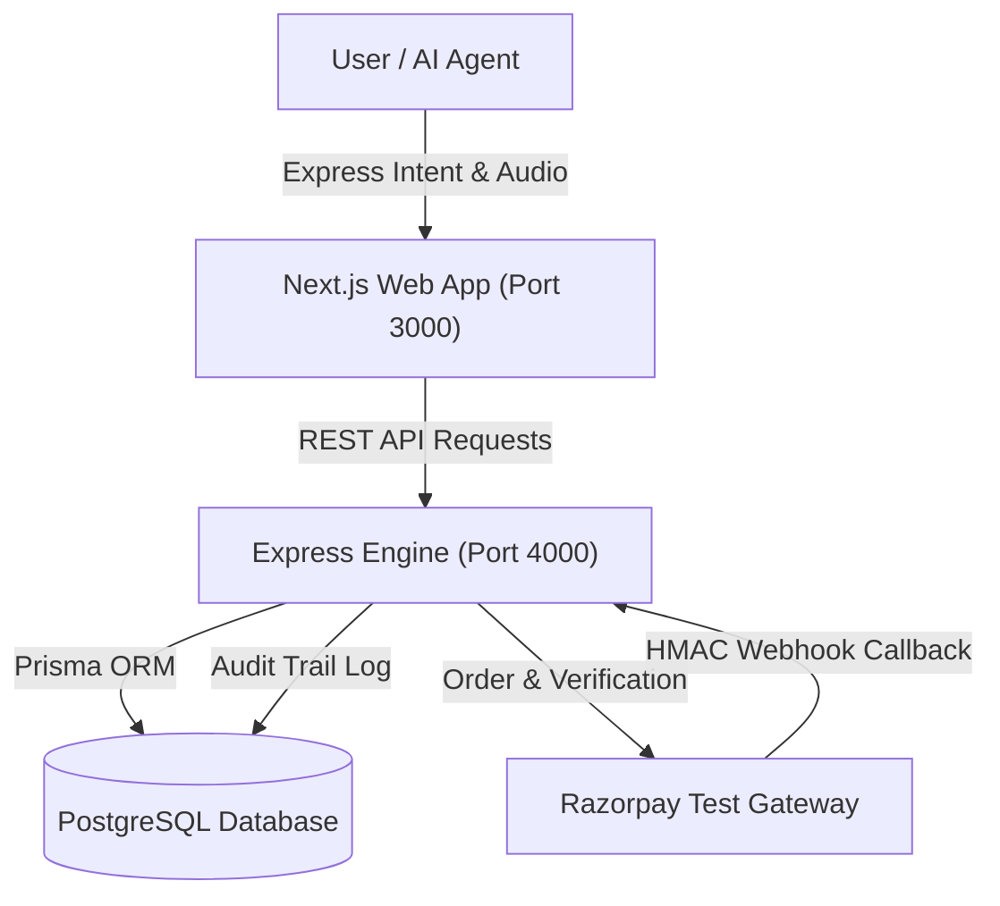
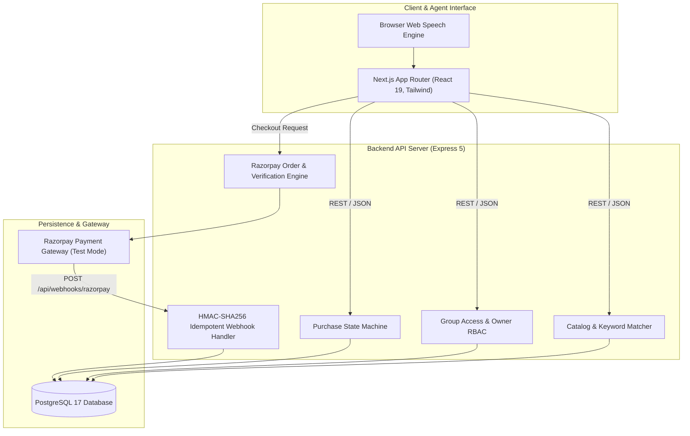
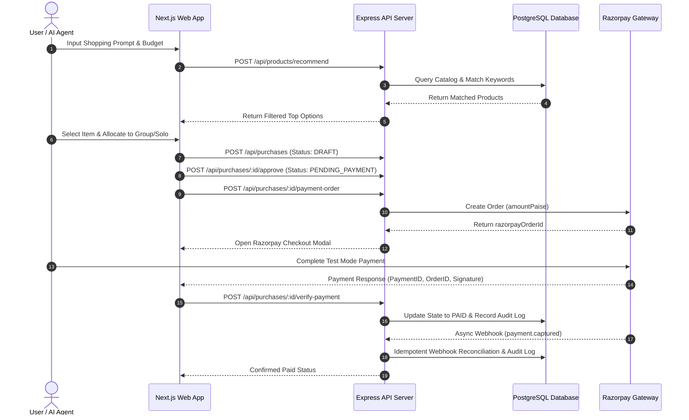
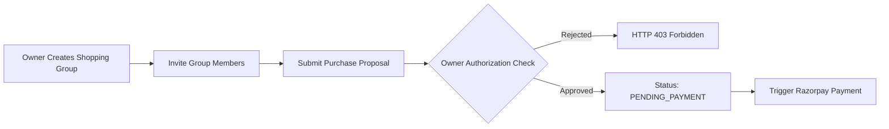
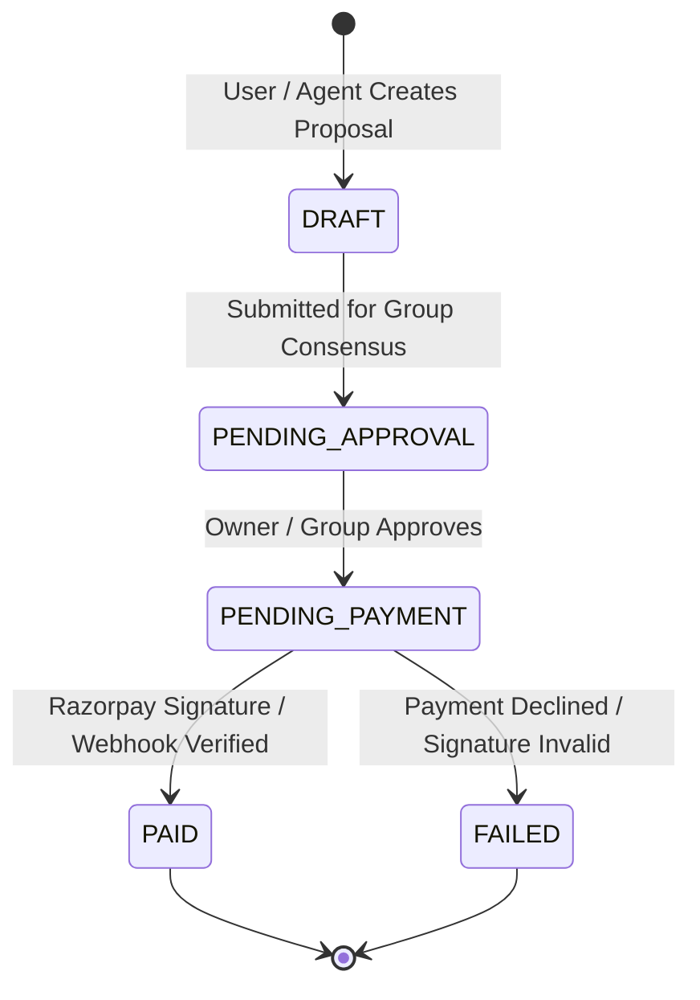
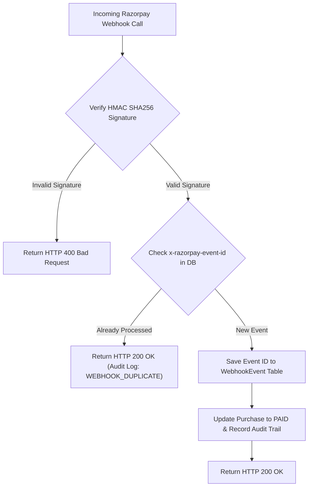

# TOGETHER — Autonomous Agentic Commerce & Collaborative Procurement Engine

> **Razorpay Buildathon Submission**  
> **Track**: *AI Growth & Agentic Commerce* — Growing merchant revenue and making merchants 100% transactable by AI buyers end-to-end with bounded, explainable, and audited payment execution.

---



---

## 🏆 Razorpay Buildathon Alignment & Vision

### The Problem
Traditional e-commerce platforms were built for humans browsing websites with manual mouse clicks. As AI agents become the primary buyers of products on behalf of individuals, families, and organizations, merchants risk losing revenue unless their catalog, purchasing rules, and checkout APIs are **agent-readable and agent-transactable**. Furthermore, group purchases (travel, office supplies, team gear) suffer from fragmented communication, unverified payment split requests, and budget overruns.

### The Solution: TOGETHER
**TOGETHER** is an end-to-end Agentic Commerce & Collaborative Procurement Engine integrated with **Razorpay Test Mode APIs**. It enables both solo buyers and collaborative groups to:
1. **Express Natural Intent**: State purchase needs via text or audio input.
2. **Execute Agentic Catalog Search**: Match prompt intent against 100+ items, enforce exact price bounds, and prevent budget overruns automatically.
3. **Establish Consensual Group Approval**: Manage group membership, enforce owner authorization, and maintain transparent consensus.
4. **Autonomous Bounded Payment Execution**: Execute Razorpay Test Mode checkouts with server-side HMAC SHA256 signatures, idempotent webhook reconciliation, and a complete audit trail.

---

## 📐 Interactive System Flow & Architecture Diagrams

### 1. System Architecture Diagram




---

### 2. Complete User Journey Diagram




---

### 3. Group Procurement & Approval Flow




---

### 4. Product Matching & Budget Guard Engine


---

### 5. Purchase State Machine




---

### 6. Database Schema & Entity Relationships


---

### 7. Razorpay Payment Sequence


---

### 8. Webhook Idempotency & Deduplication




---

### 9. REST API Endpoint Structure


---

### 10. Failure Modes & Recovery Engine


---

## 🌟 Key Features & Innovations

- 🤖 **Intelligent Agentic Catalog Matching**: Ranks 100+ catalog products based on keyword relevance and budget limits. Includes budget overflow warnings and filter tabs.
- 👥 **Group Commerce & Role-Based Access Control**: Owners create groups, invite members, and maintain exclusive control over membership edits. Rejects non-member group purchase attempts with HTTP 403.
- 🔐 **Dual Payment Verification**: Combines client signature verification with fallback server-to-server Razorpay REST API checks (`razorpay.payments.fetch(paymentId)`).
- 🛡️ **Cryptographic Webhook Idempotency**: Secures `POST /api/webhooks/razorpay` with `crypto.timingSafeEqual` signature checks and prevents duplicate delivery replay attacks.
- 📋 **Immutable Audit Log**: Records every state change (`PURCHASE_CREATED`, `APPROVAL_GRANTED`, `PAYMENT_CONFIRMED`, `WEBHOOK_DUPLICATE`) with timestamped metadata.

---

## 🛠️ Tech Stack & Infrastructure

- **Frontend**: Next.js 16 (App Router, Turbopack), React 19, Tailwind CSS v4
- **Backend**: Express 5, Node.js (v20+), TypeScript
- **Database & ORM**: PostgreSQL 17 (Docker container `together-postgres`), Prisma ORM 7
- **Payment Infrastructure**: Razorpay Test Mode APIs & Webhooks
- **Testing**: Native Node.js Test Runner (`node:test`, `node:assert/strict`) with `tsx`

---

## 🚀 Local Development Setup

### 1. Prerequisites
- **Node.js**: v20 or higher
- **Docker Desktop**: For running PostgreSQL locally

### 2. Launch PostgreSQL Container
```bash
docker compose up -d
```
*Maps local port `5433` to container port `5432`.*

### 3. Environment Setup
Copy template configuration files in `apps/api` and `apps/web` for your local environment variables.

### 4. Install Dependencies
```bash
npm install
```

### 5. Database Setup & Seeding
```bash
cd apps/api
npx prisma migrate dev
npx tsx prisma/seed.ts
cd ../..
```

### 6. Start Development Servers
Run backend API and frontend concurrently:
```bash
# Terminal 1: API Backend (Port 4000)
cd apps/api
npm run dev

# Terminal 2: Next.js Web App (Port 3000)
cd apps/web
npm run dev
```

---

## 🧪 Automated Test Suite

The repository features an end-to-end automated test suite testing catalog search, group access permissions, payment validation, and webhook idempotency:

```bash
# Run all tests from root directory
npm test
```

### Test Coverage Highlights (17/17 Passing):
- **Catalog & Products (`tests/products.test.ts`)**: Lookup, keyword matching, budget filtering, 404 validation.
- **Groups & Memberships (`tests/groups.test.ts`)**: Group creation, owner protection, duplicate rejection (409), member removal.
- **Purchases & Approvals (`tests/purchases.test.ts`)**: Group ownership validation, non-member rejection (403), draft state transition.
- **Webhooks & Idempotency (`tests/webhooks.test.ts`)**: HMAC SHA256 timing-safe check, payload tampering rejection, idempotency deduplication.
- **End-to-End (`tests/e2e-payment.test.ts`)**: Complete purchase cycle from intent to Razorpay payment settlement.

---

## 📄 License

ISC License. Built for the Razorpay Buildathon 2026.
